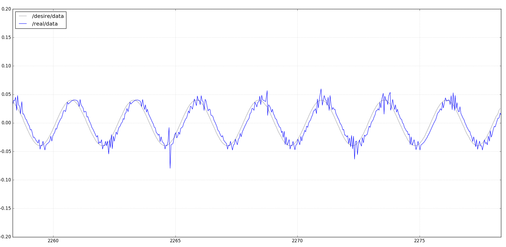

# JAKA机械臂速度控制接口

## 说明

基于ROS消息机制，监听发布的速度信号，将之转换为关节转角控制量，调用JAKA机械臂的伺服控制接口完成机械臂速度控制。从而实现从速度控制到位移控制的转换。

本功能包包含2个cpp文件，相应的功能描述如下：

**jakatest.cpp**:

- 连接JAKA机器人、使能、上电
- 启动ROS节点velocity_listener
- 监听velocity_talker节点发布的速度消息，积分为位移，调用伺服控制接口控制机械臂移动
- 发步期望位移和由电控柜读取到的真实位移数据，便于后续观测

**talker.cpp**:

- 启动ROS节点velocity_talker，发布速度控制量

## 测试结果

如图灰色曲线和蓝色曲线分别为机械臂某一关节的期望位移和实际位移，其中期望位移根据速度积分得到，实际位移由机器人电控柜读取。

## 注意事项

- 本代码的速度控制和速度读取使用单线程完成，尽管在实际使用中肉眼观测不到机器人的抖动，但如上图读取的机器人实际位移曲线中仍然存在尖刺，关于尖刺产生的原因，我们分析是由于读取关节转角所占用的时间影响了控制周期。

在实际测试中使用3个独立的线程分别下发控制量、读取和发布真实值、发布期望值能有效消除尖峰现象。
- 读取机器人当前关节角的方法有两种：get_robot_status(&status)和get_joint_position(&real_joint_pos)。前者从控制器中读取机器人所有的状态量status，再从中取出关节角；后者直接从伺服电机中读取机器人关节角。

在实际的伺服控制中，后一种方法会占用伺服电机，导致伺服控制出现明显的抖动；前者不影响伺服电机运动。因此使用：get_robot_status(&status)是更好的选择。
